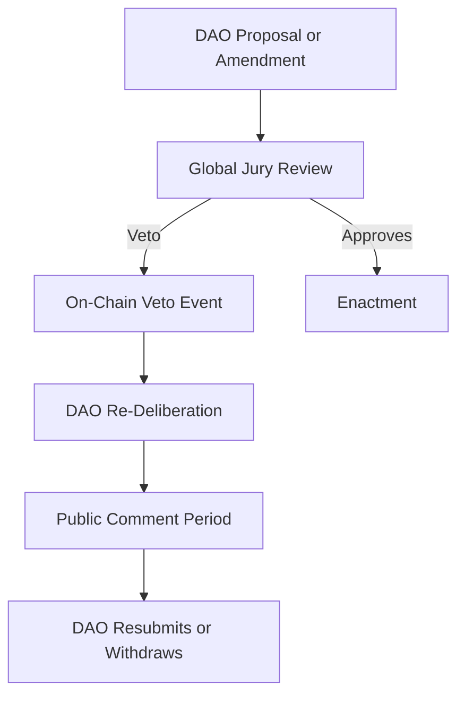

# Constitution Draft: Entrenching Values & Amendment Thresholds

## Table of Contents
1. Purpose & Objectives
2. Deliverables & Dependencies
3. Amendment Thresholds
4. Incompatibility Clause
5. Digital Binding in Smart Contracts
6. Emergency Pause (“Circuit Breaker”)
7. Sanctions & Conflict Resolution
8. Grievance & Escalation Channel
9. Anti-Discrimination Clause
10. Reserved Representation
11. Hardship Waiver
12. Accessibility Mandate
13. Living Review & Update Cadence
14. Sample Amendment Proposal Template
15. Technical Note: constitution_hash in Smart Contracts

## Purpose
Draft the constitutional layer that entrenches One Planet’s core values and sets high thresholds for amendments.

## Objectives
- Codify foundational values (equality, ethics first, transparency, inclusion, etc.)
- Define amendment process (supermajority + constitutional jury)
- Specify rights and duties of members, juries, and contributors
- Detail conflict resolution and veto mechanisms
- Ensure the Constitution is periodically reviewed for fairness, accessibility, and bias (see 'Living Review & Update Cadence')

## Deliverables
- Constitution draft (Markdown)
- Amendment and ratification process
- Alignment matrix with legal and technical layers

## Dependencies
- Regulatory Track (for legal fit)
- Identity Layer R&D (for membership definition)
- Tokenomics/Soul-Credits (for governance mechanics)

## Related Documents
- REGULATORY_TRACK.md
- IDENTITY_LAYER_RND.md
- TOKENOMICS_SOULCREDITS.md

---

### Amendment Thresholds
- Amendments require ≥66⅔% of all verified voting members and ≥60% of the Global Citizens’ Jury. (See also: System Blueprint §3 and §6 for process cross-reference)
- Quorum: Minimum participation of 40% of verified votes for any amendment.

## Sample Amendment Proposal Template
```markdown
### Amendment Title
- Short, descriptive title for the proposed change.

### Background & Rationale
- Brief explanation of why the amendment is needed, including any relevant data, feedback, or audit findings.

### Proposed Changes
- List of specific sections/clauses to be added, modified, or removed, with exact wording.

### Impact Assessment
- Analysis of expected effects on governance, equity, security, and compliance.
- Reference to any KPIs or audit findings that triggered the proposal.

### Implementation Plan
- Timeline, responsible parties, and any required technical or legal steps.

### References
- Links to related documents, discussions, or prior amendments.
```

### Incompatibility Clause
- Active lobbyists, corporate board members of partner firms, or donors >€100,000 are barred from Foundation/Jury roles.

### Digital Binding in Smart Contracts
- The current constitution_hash must be referenced in all governance and allocation smart contracts.
- Any amendment must update the constitution_hash and trigger a public on-chain event.

## Technical Note: constitution_hash in Smart Contracts
- The constitution_hash is a cryptographic hash (e.g., SHA-256) of the canonical Markdown file, computed and published with each ratified version.
- All relevant smart contracts store the current constitution_hash as an immutable or updatable field, depending on contract design.
- Contracts expose a public getter (e.g., getConstitutionHash()) to allow any party to verify the version in force.
- When an amendment is ratified, the constitution_hash is updated via a governance transaction, and an on-chain event (e.g., ConstitutionUpdated) is emitted for transparency and auditability.
- Off-chain clients and dApps are required to check the constitution_hash before executing governance actions.

### Emergency Pause (“Circuit Breaker”)
- 2/3 of the Global Jury can pause operations for up to 14 days; further extension requires a full-member vote.

---

### Sanctions Enforcement Process
- **Step 1: Warning** — Formal warning issued and logged on-chain (event emitted by the DAO contract).
- **Step 2: Suspension** — Temporary suspension (e.g., voting/membership rights paused for 30 days), triggered by a DAO proposal and confirmed by on-chain event.
- **Step 3: Removal** — Permanent removal requires a higher threshold DAO vote and emits a removal event on-chain.
- **Appeals Path:** Any sanction can be appealed to the Regional Trust or Global Jury within 7 days. Appeals are resolved by mini-public sortition or Jury vote, with all outcomes logged on-chain.

### Conflict-Resolution Workflow
- See [Sample Amendment Proposal Template](./SAMPLE_AMENDMENT_PROPOSAL.md) for format and process.
- If the Global Jury exercises a veto on any amendment or major proposal:
    1. The veto event is logged on-chain.
    2. The proposal is returned to the DAO for re-deliberation, with a mandatory public comment period (e.g., 14 days).
    3. The DAO may revise and resubmit, or withdraw the proposal.

#### Jury Veto and DAO Re-Deliberation Flow


### Grievance & Escalation Channel
- A secure, anonymous reporting channel must be maintained for all members to report human rights abuses, discrimination, or other serious grievances.
- All credible reports of human rights abuse are immediately escalated to a vetted network of pro-bono legal and civil society partners for independent review and support.
- Whistleblowers and complainants are protected by strict confidentiality and non-retaliation guarantees.

### Anti-Discrimination Clause
- The Constitution explicitly bans discrimination on the basis of race, gender, language, religion, disability, or digital access level in all governance processes, membership, and service provision. (See also: System Blueprint §12 Fairness-By-Design)
- Any proven violation is grounds for immediate sanction and possible removal, following the sanctions and appeals process.

### Reserved Representation
- At least 10% of seats on all Regional Trust boards and Citizens’ Juries are reserved for individuals from historically marginalized groups (to be defined in the bylaws, including but not limited to ethnic, linguistic, gender, and disability status).
- The nomination and selection process for these seats must be transparent, with clear eligibility and rotation rules.

### Hardship Waiver
- Any individual who is a refugee, stateless person, or living below the global poverty line is eligible for a full or partial waiver of membership or participation fees.
- Applications for hardship waivers are submitted through a confidential process, reviewed by the Governance Committee or its designated agent, and reassessed annually.
- No member may be excluded from participation solely due to inability to pay.

### Accessibility Mandate
- The Constitution requires that all governance interfaces (web, mobile, and physical) meet WCAG 2.1 AA accessibility standards. (See also: System Blueprint §14 Global Accessibility Charter and IDENTITY_LAYER_RND.md)
- All core governance and voting flows must support offline/USSD access for low-connectivity regions, ensuring no member is excluded due to digital divide.

---

## Living Review & Update Cadence
- **Review Frequency:** The Constitution must be reviewed at least annually, or whenever a major system, legal, or governance change occurs. (See also: System Blueprint §15 Living Review & Update Cadence)
- **Responsible Parties:** The Governance Committee, with input from the community and technical leads.
- **Triggers for Update:** Major amendments, audits, regulatory changes, or identification of new fairness/accessibility gaps.
- **Equity Audit:**
    - **Scope:** The annual equity and fairness audit covers all governance, onboarding, and allocation modules, with a focus on outcomes for marginalized and protected groups.
    - **Methodology:** The audit includes quantitative analysis (Minority Satisfaction Index, Voice Equality Index, Accessibility KPIs, Empowerment KPI) and qualitative review (case studies, appeals, grievances).
    - **Reporting:** Results are published in a public report, including findings, recommendations, and a timeline for remediation.
    - **Follow-up:** The Governance Committee is responsible for implementing audit recommendations and reporting progress in the next annual review.
- **Transparency:** All reviews, audits, and their results are logged in the public repository, and a summary of findings and required actions is provided.


