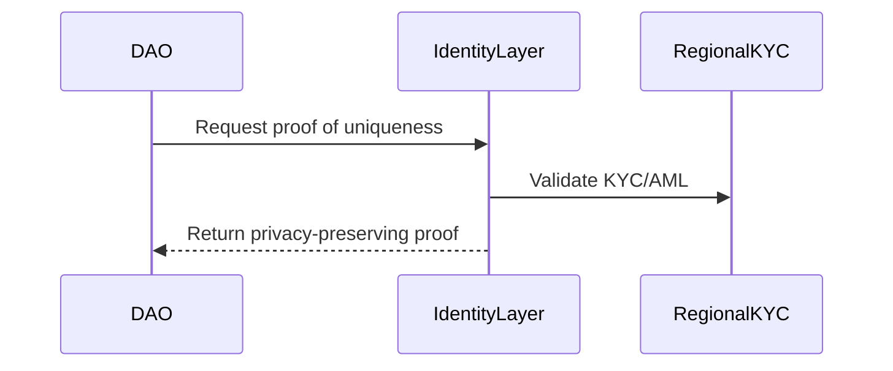

# Identity Layer R&D

> _For inclusion, accessibility, and appeals mandates, see the [Constitution Draft](./CONSTITUTION_DRAFT.md) (§8, §10) and [System Blueprint](./ONE_PLANET_SYSTEM_BLUEPRINT.md) (§12 Fairness-By-Design, §14 Global Accessibility Charter)._: Sybil-Resistant, Privacy-Preserving Proof of Uniqueness

## Purpose
Research and prototype an identity layer that provides Sybil resistance and privacy-preserving proof of uniqueness for One Planet participants.

## Objectives
- Evaluate existing decentralized identity solutions (World ID, Proof-of-Humanity, eIDAS pass-through, etc.)
- Prototype a privacy-preserving proof-of-personhood system
- Assess trade-offs: privacy, UX, scalability, attack resistance
- Define integration points with DAO membership and KYC (regional trust)
- Document regulatory and ethical implications

## Deliverables
- Comparative analysis of candidate solutions
- Prototype implementation (MVP)
- Integration plan with One Planet DAO
- Risk and privacy impact assessment

## Dependencies
- Regulatory Track (for legal compliance)
- Constitution Draft (for values alignment)

## Related Documents
- REGULATORY_TRACK.md
- CONSTITUTION_DRAFT.md

---

### Revocation & Appeals Process
- Automated flag triggers 60-hour temporary deactivation.
- User may appeal via the Regional Trust portal.
- Mini-public (sortition) decision within 7 days.

### Zero-Knowledge Primitives Decision
- Recommend Semaphore (Merkle tree + Groth16) for privacy and mobile-friendly gas costs.

### Scalability KPIs
- Proof generation ≤ 1 second on low-end Android devices.
- Verification ≤ 60,000 gas per operation.

### Integration Diagram


### Risk Matrix
| Threat                | Likelihood | Impact |
|-----------------------|------------|--------|
| Sybil Attack          | Medium     | High   |
| DoS (Denial of Service)| Low        | High   |
| Deep-fake Biometrics  | Low        | High   |
| Data Leakage          | Low        | High   |
| False Positive Revokes| Low        | Medium |

---

### Credential Recovery (Social Recovery)
- Users can designate 2-of-3 trusted guardians (other members or external contacts) for account recovery.
- If a credential is lost, the user requests recovery; at least 2 of the 3 guardians must approve the request.
- After guardian approval, a grace period (e.g., 7 days) is enforced, during which the user must complete a re-biometrics check to finalize recovery.
- All recovery actions are logged and rate-limited to prevent abuse.

### False-Positive Appeal UX
**Step-by-Step User Experience for Contesting Wrongful Deactivation:**
1. **Notification:** User receives notification of deactivation (email, app, or SMS), with a clear reason and appeal link.
2. **Appeal Portal:** User clicks link to access the appeal portal, which displays:
    - Reason for deactivation
    - Evidence or flagged activity
    - Appeal submission form
3. **Evidence Submission:** User uploads supporting documents, provides a statement, and (optionally) requests a video or live-biometrics review.
4. **Appeal Review:** Regional Trust mini-public or admin reviews the case within 7 days.
5. **Decision Notification:** User is notified of the outcome (reinstatement or upholding of deactivation), with a clear explanation and further escalation options if denied.
6. **Audit Log:** All steps are recorded for transparency and future audits.

---

### Offline & Low-Tech Paths
- For individuals without smartphones or internet access, the system provides:
    - Paper-based attestations, validated by in-person community agents or trusted notaries.
    - Community-agent enrollment, where a designated local representative verifies identity and issues a one-time use code or QR for onboarding at a later date.
- All offline attestations are logged and subject to random audits to prevent abuse.

> _See also: [Constitution Draft](./CONSTITUTION_DRAFT.md) §10 Accessibility Mandate and [System Blueprint](./ONE_PLANET_SYSTEM_BLUEPRINT.md) §14._
### Language & Literacy Adaptations
- All onboarding and credential recovery flows must support:
    - Multi-lingual voice prompts (IVR or app-based)
    - Pictographic guides and step-by-step visuals for low-literacy users
    - Local language support for at least the top 5 languages per region

### Inclusivity KPIs
- The system tracks and publishes the percentage of successful on-ramp completions segmented by:
    - Gender
    - Rural vs. urban location
    - Income bracket (where available)
- Inclusivity KPIs are reviewed quarterly, and any group with <90% success rate triggers a process review and targeted outreach.

> _See also: [Constitution Draft](./CONSTITUTION_DRAFT.md) §8 Anti-Discrimination and [System Blueprint](./ONE_PLANET_SYSTEM_BLUEPRINT.md) §12 Fairness-By-Design._

### Zero-Cost Proofs
- All users are guaranteed the ability to generate ZK-proofs for onboarding, recovery, and voting at zero cost.
- No user should incur data, SMS, or transaction fees for proof generation; the system subsidizes all such costs, including offline/USSD channels.

### Vulnerable-Mode (Privacy Shield)
- Any user may opt-in to a "Privacy Shield" mode, which suppresses the collection and display of location and demographic data during onboarding and credential recovery.
- This mode is recommended for activists, journalists, and at-risk individuals, and is available at all onboarding and recovery points.
- Privacy Shield status is confidential and cannot be used to restrict access or participation.

### Guardian Training Program
- All community agents and notaries must complete an official Guardian Training Program before being authorized to onboard or recover members.
- The program includes anti-abuse protocols, privacy/confidentiality training, and periodic recertification.
- Reports of agent misconduct are reviewed independently, with mandatory retraining or decertification for violations.

---

## API Specification
### Proof-Request Endpoint
- **POST /api/proof-request**
    - **Payload:**
      ```json
      {
        "user_id": "string",
        "proof_type": "onboarding|recovery|voting",
        "public_signals": ["string"],
        "external_nullifier": "string"
      }
      ```
    - **Responses:**
      - 200 OK: `{ "proof": "<zk-proof-object>", "status": "success" }`
      - 400 Bad Request: `{ "error": "invalid_payload" }`
      - 403 Forbidden: `{ "error": "user_not_eligible" }`
      - 500 Internal Server Error: `{ "error": "server_error" }`

### Appeal Endpoint
- **POST /api/appeal**
    - **Payload:**
      ```json
      {
        "user_id": "string",
        "revocation_reason": "string",
        "appeal_message": "string",
        "evidence_urls": ["string"]
      }
      ```
    - **Responses:**
      - 200 OK: `{ "appeal_id": "string", "status": "submitted" }`
      - 400 Bad Request: `{ "error": "invalid_payload" }`
      - 404 Not Found: `{ "error": "user_not_found" }`
      - 409 Conflict: `{ "error": "appeal_already_pending" }`
      - 500 Internal Server Error: `{ "error": "server_error" }`

---

## Implementation Sketch: Semaphore Integration
```python
# Example: Verifying a Semaphore proof (Python pseudocode)
from semaphore import Semaphore, verify_proof

def verify_user_proof(proof, public_signals, external_nullifier, merkle_root):
    try:
        is_valid = verify_proof(
            proof=proof,
            public_signals=public_signals,
            external_nullifier=external_nullifier,
            merkle_root=merkle_root
        )
        return {"valid": is_valid}
    except Exception as e:
        return {"valid": False, "error": str(e)}
```
- This function checks the validity of a user's ZK-proof using Semaphore primitives.
- In production, use audited libraries and verify on-chain as well as off-chain.

---

## Dashboard Design: Inclusion KPIs
#### Inclusion Metrics Dashboard (Mockup)
| Region        | Gender (F/M/NB) | Rural (%) | Urban (%) | On-Ramp Success (%) | Accessibility Score | Privacy Shield Opt-In (%) |
|---------------|-----------------|-----------|-----------|---------------------|---------------------|--------------------------|
| Rural Kenya   | 55/43/2         | 90        | 10        | 88                  | 0.92                | 7                        |
| Urban Brazil  | 51/47/2         | 8         | 92        | 93                  | 0.96                | 4                        |
| Refugee Camp  | 49/49/2         | 100       | 0         | 81                  | 0.89                | 12                       |

- **On-Ramp Success:** % of successful onboarding attempts.
- **Accessibility Score:** Composite metric (WCAG + USSD/offline support).
- **Privacy Shield Opt-In:** % of users choosing vulnerable-mode.


flowchart TD
    A[Start: Join One Planet] --> B{Has Smartphone/Internet?}
    B -- Yes --> C[Online Onboarding (App/Web)]
    B -- No --> D[Offline Path: Paper/Community Agent]
    C --> E{Pass KYC & Proof-of-Personhood?}
    D --> F[Agent/Notary Attestation]
    F --> E
    E -- Yes --> G[Member Credential Issued]
    E -- No --> H[Appeal or Retry]
    H --> I{False Positive?}
    I -- Yes --> J[Appeal via Portal/Agent]
    I -- No --> K[Wait & Retry]
    J --> L[Mini-Public/Jury Review]
    L --> M{Reinstated?}
    M -- Yes --> G
    M -- No --> N[Deactivation Upheld]
    G --> O[Credential Recovery Needed?]
    O -- Yes --> P[2-of-3 Guardians or Re-Biometrics]
    P --> G
    O -- No --> Q[Active Member]

    style G fill:#d4f7d4,stroke:#333,stroke-width:2px
    style N fill:#fdd,stroke:#333,stroke-width:2px