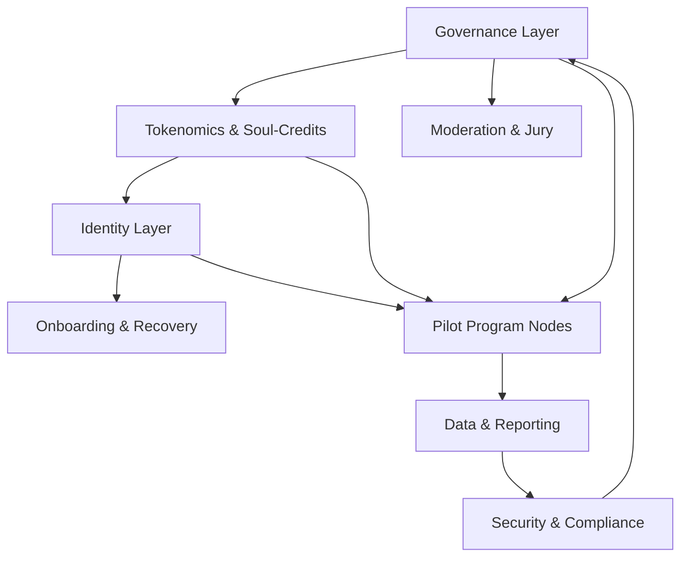
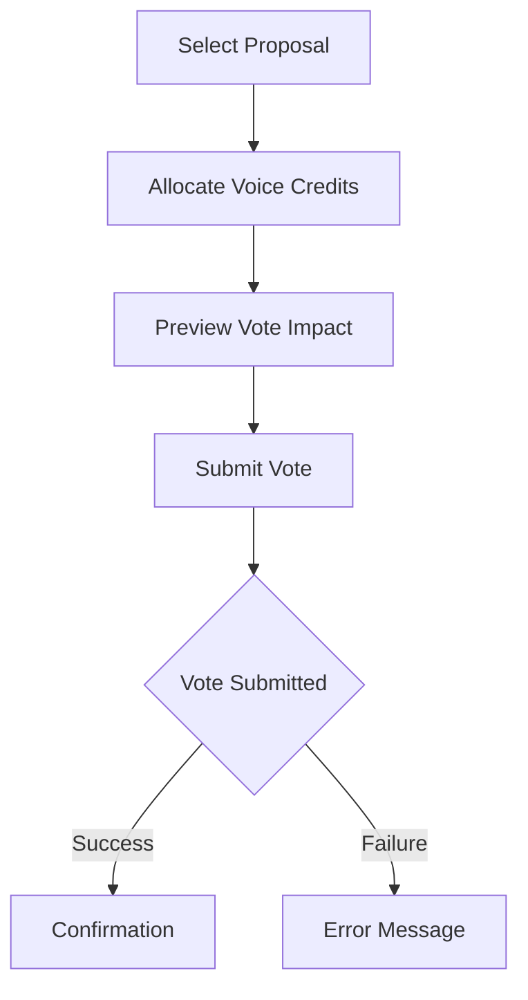
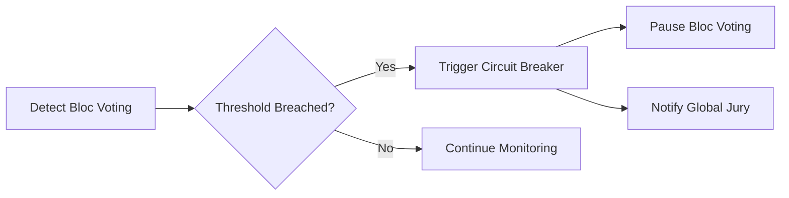

# One Planet – Ethical System Blueprint (English)

---

## Table of Contents
1. Introduction
2. Core Values & Ethical Foundation
3. Governance Structure
4. Technical Architecture
5. Community & Communication
6. Financial Model & Sustainability
7. Security & Anti-Corruption
8. Roadmap & Milestones
9. Maintenance & Factoring Principles
10. Glossary & Inline Notes
11. System Architecture Overview
12. Fairness-By-Design
13. Power Structure Circuit Breakers
14. Global Accessibility Charter
15. Living Review & Update Cadence

---

## 1. Introduction

One Planet is a supranational, nonprofit federation for global citizens. It pools a small monthly contribution per member into a transparent, decentralized fund to support urgent relief, public goods, and planet-positive projects. Every process, decision, and algorithm is radically transparent and open source. This document provides a step-by-step, maintainable blueprint for building the One Planet system, with inline notes to clarify all concepts and decisions.

> _For foundational values, amendment process, and anti-discrimination mandates, see the [Constitution Draft](./CONSTITUTION_DRAFT.md)._
---

## 2. Core Values & Ethical Foundation

- **Equality:** One person, one voice. No special rights for donors or officials.
- **Transparency:** Every transaction, decision, and algorithm is public (subject to privacy class model).
- **Inclusion:** Accessible for all, regardless of background or ability.
- **Ethics First (Constitutional Principle):** All investments and actions must align with humanity, peace, and sustainability. This is a non-negotiable, constitutional value that cannot be diluted by future majorities.
- **Open Source:** All code and knowledge is open and reusable.
- **Resilience:** Systems are designed for crisis resistance and long-term sustainability.

> _Inline Note: These values are enshrined in a supreme charter (constitutional layer). Any amendment requires a supermajority and approval by a randomly selected Constitutional Ethics Jury. 'Ethics first' is enforced by this jury, which adjudicates violations and can issue sanctions (suspension, exclusion, public censure, or referral to legal authorities)._

### 2.1 Privacy Class Model

To reconcile radical transparency with legal data protection (GDPR and similar):
- **Public Data:** System rules, aggregate statistics, anonymized proposal/vote data, financial flows (no personal identifiers).
- **Member-Only Data:** Individual voting records, KYC/AML information, sensitive proposals, internal discussions.
- **Redacted/Private Data:** Personal data (names, contact, ID), protected by strong encryption and never made public. Only accessible to authorized roles under strict audit.

> _Inline Note: The privacy class of each dataset is defined early and documented. All data handling is GDPR-compliant. Radical transparency applies only to public and aggregate data; personal data is always protected._

---

## 3. Governance Structure

### 3.1. Foundation Layer
- **International Foundation (e.g. Switzerland/Netherlands):** Holds the charter and assets. Board consists of 3 randomly selected citizens, 2 expert trustees, 2 audit seats.

### 3.2. Regional Trusts
- **Legal Entities (Associations/Trusts):** Handle payments, KYC/AML, local compliance. Each with a 5-person board, annually elected.

### 3.3. DAO Cooperative
- **Blockchain-based Membership:** All daily governance, budgets, and smart contracts are managed here. Decisions via Quadratic Voting; all members participate.

### 3.4. Citizens' Jury
- **Nested Sortition Panels:** Regional juries (randomly selected, rotating) deliberate first; only major or escalated issues reach the global jury. All juries must publish plain-language rationales for decisions. For highly contentious issues, deliberative mini-publics may be convened.
- **Oversight, Veto, and Ethics Review:** Global jury retains ultimate veto and constitutional review powers.

> _Inline Note: This multi-layered, nested jury structure reduces capture risk and improves legitimacy. Publishing rationales increases transparency and trust._

### 3.5. Escalation Paths for Inter-Layer Conflicts
- **Step 1:** Attempt resolution at the lowest relevant layer (e.g., Regional Trusts for local issues, DAO for operational matters).
- **Step 2:** If unresolved, escalate to the next layer (e.g., DAO to Citizens’ Jury, Regional Trusts to Foundation Board).
- **Step 3:** Citizens’ Jury/global jury adjudicates constitutional and value-based conflicts, with published rationale.
- **Step 4:** In case of deadlock, a randomly selected constitutional mini-public is convened for final arbitration.

> _Inline Note: This protocol ensures all conflicts have a transparent, stepwise resolution path. Examples: If a DAO vote is vetoed by the Citizens’ Jury, the rationale is published and the issue is re-examined or escalated to a mini-public for binding decision._

---

## 4. Technical Architecture

### 4.1. Payments
- Integrate global rails (SEPA, UPI, M-Pesa, USSD, etc.) via open-source gateways.
- 1-click mandate for easy onboarding.

### 4.2. Ledger & Treasury
- **EVM-compatible Sidechain (e.g. Gnosis Chain):** Uses Proof-of-Authority (PoA) for pragmatic energy efficiency in early stages.
  - **Validator Selection & Rotation:** Validators are transparently selected by community vote, with strict public criteria and regular rotation schedules.
    - **Rotation Cadence:** Every 2 months, or if a validator’s average uptime drops below 97% over any 30-day window.
    - **Minimum Validators:** At least 15 independent validators at all times.
    - **Slashing Rate:** 5% of stake slashed for misbehavior or downtime, enforced automatically by smart contracts.
  - **Migration Path:** As scale and neutrality demands increase, plan migration to a rollup (e.g., zkSync, Polygon CDK) for greater neutrality and lower infrastructure overhead.
  > _Inline Note: PoA is pragmatic for launch, but rollup migration is a core part of the roadmap for long-term neutrality and security._
- All transactions mirrored on a public explorer.
- Multisig treasury (e.g. Gnosis Safe) for fund management.

### 4.3. Storage
- IPFS/Filecoin cluster for all documents, proposals, and logs.

### 4.4. Compute
- **CO₂-neutral GPU Cluster:** Used for AI and analytics. All moderation ML models are open source, and community-run inference nodes are allowed and encouraged.
  > _Inline Note: The foundation cluster is only one option; decentralizing inference nodes prevents centralization and single points of failure._

### 4.5. Security
- Hardware HSM, multisig, and bug bounty program.

### 4.6. Decentralized Identity & Sybil Resistance
- **Decentralized Identity Layer:** On-chain participation requires privacy-preserving proof-of-personhood, using integrations such as World ID, Proof-of-Humanity, or eIDAS pass-through.
  - KYC at Regional Trusts is only one layer; global Sybil resistance is enforced on-chain.
  > _Inline Note: Decentralized identity is essential for preventing Sybil attacks at global scale. All identity proofs are privacy-preserving and never expose personal data on-chain._
- **Identity Recovery Flows:** For full details on credential recovery and appeals (social recovery, re-biometrics, etc.), see [IDENTITY_LAYER_RND.md](./IDENTITY_LAYER_RND.md).

### 4.6. Web Platform
- **Frontend:** Next.js (React), Tailwind CSS, i18n for multilingual support, accessibility-first.
- **Backend:** Node.js/Express, RESTful API, modular services for voting, onboarding, knowledge commons.
- **Citizen Knowledge Commons:** Uploads, semantic AI summarization, graph visualization, quadratic voting.

> _Inline Note: The architecture is modular and API-first, allowing independent development and easy scaling._

---

## 5. Community & Communication

### 5.1 Code of Conduct
- All members are expected to uphold a clear, public Code of Conduct, which defines respectful, inclusive, and fact-based behavior.
- The Code of Conduct is a versioned, living document, referenced in onboarding and all community spaces.

### 5.2 Moderation & Strike/Appeal Process
- Moderation is handled by a rotating committee of trained volunteers.
- Violations of the Code of Conduct result in a transparent, progressive strike system:
  - **1st Strike:** Warning, with rationale published in the public log.
  - **2nd Strike:** Temporary suspension (duration specified, rationale published).
  - **3rd Strike:** Permanent exclusion (with rationale published).
- All strikes and sanctions are logged on-chain or in a public, auditable registry.
- Members have the right to appeal any sanction to an independent review panel (randomly selected mini-public), whose decision is final and rationale is published.
> _Inline Note: This process ensures fairness, transparency, and accountability in community moderation. The appeal mechanism prevents abuse and builds trust._

### 5.3 On-Chain Reputation Primitive (Cred/Badges)
- Positive contributions (moderation, education, technical work, etc.) are recognized with non-transferable, soul-bound badges ("cred"), issued on-chain.
- Badges are portable and public, building social capital across DAOs and communities.
- Reputation is never used to gate basic rights (e.g., voting), but can be used for recognition, eligibility for advanced roles, and community trust.
> _Inline Note: On-chain reputation builds a culture of positive contribution and recognition, without creating plutocratic barriers._

- Open, honest, fact-based communication is mandatory.
- Education and empowerment: regular open events, tutorials, and streams.
- Channels: Intranet, Telegram, decentralized platforms, offline events.

---

## 6. Financial Model & Sustainability

- **Membership Fee:** €1/month (or local equivalent). Open to donations, but no special rights for donors.
- **Distribution:**
  - 10% liquidity reserve (rapid response)
  - 20% transformation fund (strategic purchases/legal action)
  - 65% long-term portfolio (global ETF, green/social bonds)
  - 5% overhead (IT, legal, audits, comms)
- **Unit Economics:** €0.05 overhead per member/month is tight even at scale. Regular break-even modeling is required; any cap increase must be transparently justified and approved by members.
  > _Inline Note: Overhead and sustainability are monitored with open financial dashboards; cap increases are community-driven and require full disclosure._
- **Transparency:** 100% open for members; external access by vote.
- **Emergency Fund:** Required for crisis resilience.
- **Funding Restrictions:** Only education, open-source, and citizen industries. No weapons, drugs, lobbying, or inhumane activities.

### 6.1 Donor Firewall Policy
- Large donors receive no governance, media, or partnership privileges beyond standard membership.
- All large donations and partnerships are transparently disclosed and subject to review by the Citizens’ Jury.
- Attempts at indirect influence (media, partnerships, etc.) are subject to public disclosure and potential sanction.
> _Inline Note: This policy preserves equality and prevents donor stratification, even for indirect influence attempts._

### 6.2 Budget Cap-Increase Process
- **Proposal:** Any member can propose a budget cap increase, with a clear rationale and financial projections.
- **Community Review:** The proposal is reviewed and discussed openly by the community for at least 2 weeks.
- **DAO Vote:** The proposal is put to a vote by the DAO, using Quadratic Voting.
- **Approval:** If approved, the cap increase is implemented and monitored closely for its impact on the financial sustainability of the organization.

---

## 7. Security & Anti-Corruption

- **Multisig Treasury & External Audits:** All treasury actions require multiple signatures; regular audits by independent third parties.
- **AI-Based Anomaly Detection:** Automated monitoring for unusual activity patterns.
- **Layered Human Review:** Regular red-team exercises (internal and external), ongoing bug bounty program, and a live-ops team for real-time incident response and review of AI-flagged anomalies.
  > _Inline Note: AI is a tool, not a replacement for human oversight. Human review is essential for robust security._
- **Whistleblower and Anti-Retaliation Policies:** Anonymous reporting channels and strong protections for whistleblowers.
- **Transparent, Traceable Decision Logs:** All critical actions are logged and auditable.
- **Threat Model:** See [THREAT_MODEL.md](./THREAT_MODEL.md) for the formal, living threat model (attack trees for economic, governance, and technical vectors). This is published by Phase 1-Q3 and updated regularly.

---

## 8. Roadmap & Milestones

### Phase 1: Foundation & MVP (0–12 months)
- **Pre-MVP: Legal/Regulatory Gap Analysis:** Comprehensive study of global money-movement, securities, and data protection laws.
  > _Inline Note: This step is critical for de-risking and global compliance before MVP launch._
- **Pre-MVP: Pilot-Scale Dry-Run:** Live test with ≤10,000 users in a low-risk jurisdiction to validate payment flows, cost structure, and UX.
  > _Inline Note: This ensures the system works operationally and is user-friendly before scaling up._
- Draft and publish ethical charter and governance policies.
- Register foundation and first regional trusts.
- Build DAO smart contracts (membership, treasury, voting, jury).
- Launch homepage MVP with transparency dashboard and Citizen Knowledge Commons.
- Start community forum and onboarding.
- Establish emergency fund and bug bounty program.
- Model unit economics and break-even scenarios; prepare a transparent process for cap increases if needed.
- Draft a legal memo on regulatory perimeter (fund-management, payment-institution, etc.) with external counsel.
  > _Inline Note: Legal compliance is an ongoing process and must be revisited as the project evolves and scales._
- Publish a formal threat model (attack trees for economic, governance, and technical vectors) by Phase 1 Q3. This model is a living document, open for community review and contribution.
  > _Inline Note: A formal, public threat model is essential for anticipating risks and engaging the community in defense._

### Phase 2: Community & Scale-Up (12–36 months)
- Expand to more regions; partner with NGOs and ethical companies.
- Enhance AI moderation and voting tools.
- Regular community events and education campaigns.
- Continuous open-source development.

### Phase 3: Global Impact (36+ months)
- Worldwide scaling and integration of new payment rails.
- Fund major open-source, education, and crisis projects.
- External audits, media API, ongoing community reviews.

> _Inline Note: Each milestone is documented and reviewed publicly. Progress is tracked via open dashboards._

---

## 9. Maintenance, Licensing & Codebase Governance

- **Modular Codebase:** Each service (voting, onboarding, treasury, knowledge commons) is an independent module with clear APIs.
- **Documentation:** Every module, process, and decision is documented inline and in central docs.
- **Testing:** Automated tests for all core processes (smart contracts, voting, onboarding).
- **Community Feedback:** Regular reviews and refactoring based on user and developer feedback.
- **Upgrade Path:** All components are versioned and upgradable without downtime.

### 9.1 License Strategy
- Each repository adopts an explicit license strategy early: copyleft (AGPL) or permissive (MIT), with rationale published in the repo root.
- License choice is documented and reviewed for downstream impact, interoperability, and community fit.
> _Inline Note: License selection affects openness, adoption, and sustainability. The rationale must be public and revisited as the project evolves._

### 9.2 Codebase Governance
- All significant codebase upgrades follow an open proposal process (e.g., OpenZeppelin Governor for smart contracts, PEP-style proposals for other code).
- Proposals are public, discussed openly, and require community voting or review before adoption.
- The full process is documented and referenced in every repo.
> _Inline Note: Transparent codebase governance prevents capture and ensures upgrades align with community values._

---

## 10. Glossary & Inline Notes

- **DAO:** Decentralized Autonomous Organization—blockchain-based governance.
- **Quadratic Voting:** Voting system where the cost of each additional vote increases quadratically, empowering minorities.
- **Multisig:** Multiple signatures required for treasury actions, increasing security.
- **IPFS:** Decentralized file storage system.
- **Gnosis Safe:** Popular multisig wallet for Ethereum/EVM chains.
- **Citizen Knowledge Commons:** Platform for idea submission, discussion, and democratic decision-making.

> _Inline Note: All technical and governance terms are defined here for clarity._

---

## 11. Risk Management & Capture Prevention

Scaling One Planet to billions of people exposes deep legal, governance-capture, and operational risks. This section outlines the most critical risks and the concrete, enforceable mechanisms to mitigate them.

### 11.1 Legal Risks
- **Jurisdictional Complexity:** Multi-country operations require a layered legal structure (foundation, regional trusts, DAO) to ensure compliance and resilience against hostile legal environments.
  > _Inline Note: Each legal entity is registered in a jurisdiction with strong nonprofit and open-source protections. Fallback plans for legal attacks or forced dissolution are pre-defined._
- **Regulatory Arbitrage:** Regular review of global regulations (AML/KYC, data protection, nonprofit law) with external legal counsel.
- **Liability Limitation:** Smart contracts and DAO operations are designed to limit personal liability of contributors and members.
- **Transparency:** All legal documents, policies, and compliance audits are public.

### 11.2 Governance Capture
- **Sybil Resistance:** Membership and voting rights require verified, unique identities. Multiple layers of KYC/AML and phone/ID verification are used, with privacy-preserving techniques (e.g., zero-knowledge proofs).
  > _Inline Note: No single entity or group can accumulate disproportionate influence. Voting and funding caps are enforced in smart contracts._
- **Rotation & Randomization:** All key roles (jury, board, auditors) are filled by random selection and have strict term limits.
- **Transparency:** All governance actions, votes, and proposals are logged on-chain and mirrored to public dashboards.
- **Veto & Circuit Breakers:** Randomly selected juries have veto power; emergency circuit breakers can pause operations in case of attack or abuse.
- **Open Audits:** Regular external and community audits; bug bounty programs for all smart contracts and critical infrastructure.

### 11.3 Operational Risks
- **Scalability:** Modular, API-first architecture allows for horizontal scaling. Disaster recovery plans and multi-region hosting ensure uptime.
  > _Inline Note: All critical data is redundantly stored (IPFS/Filecoin, multi-cloud backups)._
- **Fraud & Insider Threats:** Multi-signature treasury, strict access controls, and transparent logs for all transactions and admin actions.
- **Anomaly Detection:** AI-based monitoring for unusual activity patterns, with automated alerts and investigation protocols.
- **Disaster Recovery:** Regular backups, incident response playbooks, and fallback governance mechanisms.
- **Whistleblower Protection:** Anonymous reporting channels and strong anti-retaliation policies.

> _Inline Note: All risk mitigation mechanisms are documented, tested, and regularly reviewed. Any changes require transparent community discussion and approval._

---

# Next Steps
1. Initialize the codebase with modular directories for each major component (DAO, homepage, knowledge commons, etc.).
2. Draft the ethical charter and governance policies as Markdown documents.
3. Begin smart contract development for membership, voting, and treasury.
4. Scaffold the homepage MVP with clear navigation and inline documentation.
5. Set up open documentation and contribution guidelines for maintainability.

---

## System Architecture Overview



## Fairness-By-Design
Every core module (voting, moderation, allocation, etc.) must embed explicit fairness checks (e.g., demographic parity, bias detection, outcome monitoring). All algorithmic components are subject to an annual, independent audit for bias and disparate impact, with results published publicly. Any module failing fairness checks or audits must be remediated before the next release cycle.

> _See [Constitution Draft](./CONSTITUTION_DRAFT.md) §8 Anti-Discrimination and §11 Living Review for legal/ethical grounding._

### Emergency Amplifier Fund
- An on-chain Emergency Amplifier Fund is maintained to enable the Citizens’ Jury to instantly allocate funds to human rights projects and urgent relief efforts.
- Funding proposals can be submitted by any member or partner organization, with fast-track approval by the Citizens’ Jury in emergency situations.
- All allocations and their rationales are published transparently on-chain.

### Bias Bounty Program
- External auditors and community members are rewarded for identifying and reporting algorithmic or systemic bias in any One Planet module.
- A transparent reporting process is maintained, with bounties awarded for verified findings and remediation proposals.
- All bounty payouts and bias reports are logged publicly for accountability.

## Power Structure “Circuit Breakers”
In addition to financial cap-increase triggers, the system includes on-chain anti-cartel safeguards: If any group comprising more than 1% of members votes as a bloc (>80% alignment) in more than 2 consecutive epochs, an on-chain “circuit breaker” is triggered. Circuit breaker actions may include temporary suspension of bloc voting, mandatory review by the Global Jury, and/or algorithmic cap adjustments. All triggers and responses are logged and auditable.

> _See [Constitution Draft](./CONSTITUTION_DRAFT.md) §6 Emergency Pause and §7 Sanctions for governance linkage._
## Global Accessibility Charter
All governance, voting, and onboarding flows must comply with the accessibility and offline inclusion requirements detailed in [IDENTITY_LAYER_RND.md](./IDENTITY_LAYER_RND.md). Every developer team must certify compliance with WCAG 2.1 AA and offline/USSD support before launch. Accessibility and inclusion are tracked as KPIs and reported in the annual system audit.

> _See [Constitution Draft](./CONSTITUTION_DRAFT.md) §10 Accessibility Mandate for legal basis._
---

## Living Review & Update Cadence
- **Review Frequency:** This blueprint must be reviewed at least annually, or whenever a major system component, legal requirement, or governance rule changes. (See also: [Constitution Draft](./CONSTITUTION_DRAFT.md) §11 Living Review & Update Cadence)
- **Responsible Parties:** The One Planet Foundation’s Governance Committee, with input from the technical and community leads.
- **Triggers for Update:** Major feature releases, audit findings, regulatory changes, or identification of new gaps.
- **Transparency:** All reviews and updates are logged in the project’s public repository, with changes summarized in the Gaps Addressed table.

---

## API & Interface Specifications
### Voting (REST Example)
- **POST /api/vote**
    - **Payload:**
      ```json
      {
        "user_id": "string",
        "proposal_id": "string",
        "vote_weights": { "optionA": 4, "optionB": 1 },
        "proof": "<zk-proof-object>"
      }
      ```
    - **Responses:**
      - 200 OK: `{ "status": "success", "tx_hash": "string" }`
      - 400 Bad Request: `{ "error": "invalid_vote" }`
      - 403 Forbidden: `{ "error": "not_eligible" }`
      - 409 Conflict: `{ "error": "vote_already_cast" }`

### Onboarding (GraphQL Example)
```graphql
type Mutation {
  onboardUser(input: OnboardInput!): OnboardResult!
}

input OnboardInput {
  userId: String!
  region: String!
  credentials: [CredentialInput!]!
}

type OnboardResult {
  success: Boolean!
  user: User
  error: String
}
```

### Reporting (REST Example)
- **GET /api/reporting/kpis?region=RuralKenya**
    - **Response:**
      ```json
      {
        "region": "RuralKenya",
        "onRampSuccess": 88,
        "accessibilityScore": 0.92,
        "privacyShieldOptIn": 7,
        "empowermentKPI": 5
      }
      ```

---

## Sidechain Performance Targets
- **Transactions per Second (TPS):** Minimum 500 TPS sustained, with burst capacity to 2,000 TPS during voting periods.
- **End-to-End Latency:** <2 seconds for 95% of transactions; max 5 seconds for all transactions.
- **Availability:** 99.99% uptime target during critical voting and onboarding windows.

---

## UI Mockups
### Quadratic Voting Interface (Mermaid)


### Jury Dashboard (Markdown Table)
| Case ID | Status     | Votes For | Votes Against | Comments        |
|---------|------------|-----------|---------------|----------------|
| 001     | Open       | 3         | 2             | Needs more info |
| 002     | Decided    | 5         | 0             | -              |
| 003     | In Review  | 2         | 3             | Escalate       |

### Circuit Breaker (Mermaid)



## Gaps Addressed (as of 2025-04-29)

| Gap                                   | Solution/Reference                                                                                                        |
|---------------------------------------|--------------------------------------------------------------------------------------------------------------------------|
| Threat model not linked               | See [THREAT_MODEL.md](./THREAT_MODEL.md) in §7 Security & Anti-Corruption and roadmap                                    |
| Validator rotation schedule missing   | See §4.2 Technical Architecture: Ledger & Treasury                                                                       |
| License field not surfaced            | See §9.1 Repository License Table                                                                                        |
| Data retention schedule missing       | See §9.2 Data Retention Schedule Table                                                                                   |
| Budget cap-increase flow unclear      | See §6 Financial Model & Sustainability                                                                                  |
| Identity recovery flows not referenced| See §4.6 Decentralized Identity & Sybil Resistance and §9.3 Reference: Identity Recovery Flows                          |

---

_This document is the living blueprint for the One Planet system. All further steps, code, and processes will be built and documented according to this plan._

