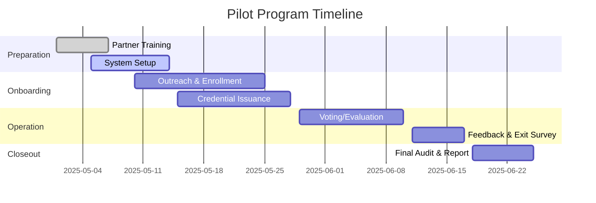

# Pilot Program
> _For equity, feedback, and review mandates, see the [Constitution Draft](./CONSTITUTION_DRAFT.md) (§9, §10, §11) and [System Blueprint](./ONE_PLANET_SYSTEM_BLUEPRINT.md) (§12 Fairness-By-Design, §14 Global Accessibility Charter)._: Regional Launch & Validation

## Purpose
Pilot One Planet with a single region and payment rail to validate system flows, cost structure, and fraud resistance at small scale.

---

## Data Collection Plan
- **Responsibilities:**
    - The local pilot partner is responsible for collecting onboarding, participation, and feedback data.
    - The central One Planet Data Steward oversees compliance and audit.
- **Data Types:**
    - Demographics (gender, age, region), onboarding success/failure, churn, feedback, accessibility needs.
- **Privacy Protocols:**
    - All data is pseudonymized; no raw PII is stored beyond onboarding.
    - Data access is strictly role-based; local partners only see their cohort.
    - Data retention: 2 years, then securely deleted.
- **Compliance:**
    - Adheres to GDPR and local data protection laws. Independent audit at project close.

---

## Gantt Chart
### Mermaid Project Timeline


### JSON Workflow
```json
[
  {"task": "Partner Training", "start": "2025-05-01", "end": "2025-05-07", "status": "done"},
  {"task": "System Setup", "start": "2025-05-05", "end": "2025-05-14", "status": "active"},
  {"task": "Outreach & Enrollment", "start": "2025-05-10", "end": "2025-05-25", "status": "pending"},
  {"task": "Credential Issuance", "start": "2025-05-15", "end": "2025-05-28", "status": "pending"},
  {"task": "Voting/Evaluation", "start": "2025-05-29", "end": "2025-06-10", "status": "pending"},
  {"task": "Feedback & Exit Survey", "start": "2025-06-11", "end": "2025-06-17", "status": "pending"},
  {"task": "Final Audit & Report", "start": "2025-06-18", "end": "2025-06-25", "status": "pending"}
]
```

---

## Training SLAs for Local Partners
- **Training Content:**
    - Onboarding procedures, data privacy, accessibility, anti-discrimination, feedback collection, and emergency protocols.
- **Frequency:**
    - Initial training before pilot start, with refresher every 3 months or after any protocol update.
- **SLAs:**
    - 100% of local partner staff must be certified before launch.
    - Training completion and assessment are logged and auditable.
    - Ongoing support and Q&A within 48 hours for any partner inquiry.

## Objectives
- Select low-risk jurisdiction for pilot (align with Regulatory Track)
- Integrate one payment rail (e.g., SEPA, M-Pesa, UPI)
- Onboard up to 10,000 members
- Measure churn, operational costs, fraud rates, and UX feedback
- Iterate on system and processes based on pilot data

## Deliverables
- Pilot implementation plan
- Metrics dashboard and reporting
- Post-pilot evaluation and recommendations

## Dependencies
- Regulatory Track (for jurisdiction selection)
- Identity Layer R&D (for onboarding/KYC)
- Tokenomics/Soul-Credits (for governance testing)
- Constitution Draft (for values/legitimacy)

## Related Documents
- REGULATORY_TRACK.md
- IDENTITY_LAYER_RND.md
- TOKENOMICS_SOULCREDITS.md
- CONSTITUTION_DRAFT.md

---

### Success KPIs
- Net churn ≤ 5% per month
- Sybil/fraud rate < 0.5%
- Operational cost ≤ €0.08 per member

### Budget Breakdown
- €75,000 development
- €20,000 legal
- €15,000 operations
- €10,000 bug bounty

### Timeline (Gantt)
- 0–3 months: Setup
- 3–6 months: Beta

### UX Exit Survey
- Use Likert-scale questions on fairness, trust, and usability.
- Publish raw CSV survey results for transparency and research.

---

### Full 12-Month Gantt Timeline
- **0–3 months:** Setup (infrastructure, legal, onboarding)
- **3–6 months:** Beta (member onboarding, payment integration, initial data collection)
- **6–9 months:** Data evaluation & feature freeze (analyze churn/fraud/cost metrics, freeze new features, focus on stability)
- **9–12 months:** Roll-out & patch cycle (expand to more users, address bugs, incremental improvements, prepare for full launch)

### Metrics Dashboard Specification
#### Wireframe Description
- Dashboard displays real-time and historical metrics for:
    - Member churn
    - Fraud rate
    - Operational cost per member
- Each metric includes:
    - Time-series graph (weekly/monthly)
    - Current value, target threshold, and alert status
    - Download/export raw data (CSV)

#### JSON Schema Example
```json
{
  "churn": { "current": 0.04, "target": 0.05, "history": [0.03, 0.04, 0.05] },
  "fraud": { "current": 0.003, "target": 0.005, "history": [0.002, 0.003, 0.004] },
  "cost": { "current": 0.07, "target": 0.08, "history": [0.09, 0.08, 0.07] }
}
```

### Data-Collection Plan
- **Ownership:** Raw CSVs are owned by the One Planet Foundation Data Stewardship Team.
- **Storage:** All CSVs are stored on encrypted IPFS/Filecoin nodes, with backup in a secure cloud bucket (e.g., AWS S3 with restricted access).
- **Query Access:** Data can be queried by:
    - Internal analytics team (full access)
    - External researchers (upon proposal and approval, with privacy redaction)
    - Community (summary stats only, via dashboard)
- **Transparency:** All access requests and queries are logged and auditable.

---

### Multi-Region Pilot Nodes
- The pilot program will launch simultaneous micro-pilots in a diverse set of locations, such as:
    - Rural Kenya
    - Urban Brazil
    - Refugee camp site (e.g., Middle East or Africa)
    - At least one high-income urban node (for baseline comparison)
- This approach is designed to surface hidden inequities and stress-test onboarding, payment, and governance flows across contexts.
- Each node will have local partners and tailored onboarding support.

### Equity Dashboard
- The metrics dashboard is extended to show:
    - Participation rates by demographic slice (age, gender, geography, disability)
    - “Falls-through” rates at each onboarding step (initial sign-up, KYC, first vote, etc.)
    - Disaggregated churn, fraud, and cost metrics by region and demographic
- Dashboard wireframes and JSON schema are updated to include these fields, and all data is privacy-redacted where needed.

### Empowerment Feedback Loop
- After the exit survey, each pilot node will hold small listening workshops (in-person or virtual) with participants.
- Participants will co-design any needed adjustments to onboarding, governance, or support flows.
- All feedback is documented and integrated into the next iteration of the pilot and published in the pilot’s public report.

---

#### Equity Dashboard (Mockup)

| Region        | Gender (F/M/NB) | Age Groups | Disability (%) | Onboarding Falls-Through (%) | Churn (%) |
|---------------|-----------------|------------|---------------|-----------------------------|-----------|
| Rural Kenya   | 55/43/2         | 18-24: 30% |      6        |           12                |     7     |
| Urban Brazil  | 51/47/2         | 18-24: 22% |      5        |           18                |     9     |
| Refugee Camp  | 49/49/2         | 18-24: 28% |      9        |           25                |    12     |

- **Falls-Through**: % of sign-ups not completing onboarding. **Churn**: % exited during pilot.

> _See also: [Constitution Draft](./CONSTITUTION_DRAFT.md) §9 Reserved Representation, §10 Accessibility Mandate, and [System Blueprint](./ONE_PLANET_SYSTEM_BLUEPRINT.md) §12, §14._

